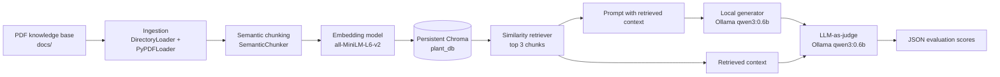

# LeafyHome India: Evidence-Grounded Plant Assistant

An end-to-end Retrieval-Augmented Generation (RAG) pipeline for answering indoor-plant questions from a curated knowledge base. The project demonstrates the full path from unstructured PDF documents to retrieved evidence, locally generated answers, and automated quality evaluation.

The system is intentionally built as a modular pipeline rather than a single notebook. Each stage has one responsibility, which makes the system easier to test, replace, and extend.

## Project Highlights

- Ingests a collection of plant-care PDF guides from `docs/`.
- Preserves source documents as LangChain `Document` objects with metadata.
- Uses semantic chunking with `sentence-transformers/all-MiniLM-L6-v2` to group related content.
- Stores chunk embeddings in a persistent Chroma vector database.
- Retrieves the three most similar chunks for each user question.
- Generates answers locally with Ollama and `qwen3:0.6b`.
- Uses a separate local LLM judge to score context relevance, faithfulness, and answer relevance.
- Records real evaluation observations, including failures caused by flattened PDF tables and the limitations of small language models.

## Architecture



At runtime, `main.py` coordinates this flow:

```text
PDF files
	-> LangChain documents
	-> semantic chunks
	-> embeddings and Chroma persistence
	-> similarity retrieval
	-> context-grounded answer
	-> evaluation scores
```

## Why This Strategy?

### Why RAG instead of asking the model directly?

Plant-care answers should be grounded in the project's reference material rather than relying only on the model's memorized knowledge. Retrieval gives the generator a small, relevant evidence window and allows the prompt to explicitly refuse unsupported answers.

### Why semantic chunking?

Fixed-size chunking is predictable and is retained in `chunking/split.py` as a baseline. However, plant-care guides often contain complete concepts such as watering schedules, light requirements, or soil recommendations. Semantic chunking attempts to keep related sentences together, which can improve retrieval quality when boundaries do not align with character counts.

The project also documents an important tradeoff: semantic splitting can produce oversized chunks or behave poorly when PDF tables have been flattened into plain text. This is why the recursive splitter remains available as a fallback and why chunking quality must be evaluated against the actual document format.

### Why local embeddings and Chroma?

`all-MiniLM-L6-v2` provides a lightweight CPU-friendly embedding model. Chroma gives the project a persistent local vector store without requiring a hosted database, API deployment, or additional infrastructure. This makes the pipeline easy to reproduce while keeping the retrieval layer replaceable.

### Why a local generator?

Ollama keeps generation local and avoids sending the plant-care knowledge base to a hosted LLM during development. It also makes experimentation with small open models inexpensive and repeatable. The tradeoff is lower answer quality and more sensitivity to prompt design than larger hosted models.

### Why evaluate the generated answer?

A successful model call does not prove that a RAG system is answering correctly. The evaluation stage asks a separate model to score:

- `context_relevance`: whether the retrieved context contains information needed for the question.
- `faithfulness`: whether the answer is supported by the retrieved context.
- `answer_relevance`: whether the answer directly addresses the question.

The evaluator returns structured JSON, making the result suitable for logging or future dashboards.

## Repository Structure

```text
.
├── docs/                       # Source plant-care PDF documents
├── ingestion/
│   └── loadfiles.py            # Loads PDFs as LangChain documents
├── chunking/
│   └── split.py                # Recursive and semantic chunking strategies
├── embeddings/
│   └── embed.py                # Embedding model and Chroma persistence
├── retrieval/
│   └── retriever.py            # Similarity retriever configuration
├── generation/
│   └── llm_generation.py       # Grounded answer generation chain
├── evaluation/
│   └── evals.py                # LLM-as-judge evaluation chain
├── main.py                     # End-to-end pipeline orchestration
├── requirements.txt            # Python dependencies
└── .env                        # Local secrets and configuration, not committed
```

## Pipeline Components

### 1. Ingestion

`ingestion/loadfiles.py` scans `docs/` for PDF files and uses `PyPDFLoader`. The loader returns one or more LangChain `Document` objects per source file, preserving page content and source metadata for downstream retrieval and inspection.

The current implementation is PDF-focused. DOCX support can be added by enabling a second `DirectoryLoader` with `UnstructuredWordDocumentLoader`.

### 2. Chunking

`chunking/split.py` exposes two strategies:

```python
split_documents_recursively(documents)
split_docs_semantic(documents)
```

The active pipeline uses semantic chunking with a minimum chunk size of 500 characters. Recursive character splitting uses a chunk size of 500 and an overlap of 30 characters and can be used as a deterministic baseline.

### 3. Embeddings and vector storage

`embeddings/embed.py` creates embeddings using:

```text
sentence-transformers/all-MiniLM-L6-v2
```

The chunks are persisted in:

```text
./chroma_langchain_db/
```

The Chroma collection is named `plant_db`. On subsequent runs, the existing database is opened instead of rebuilding it. Delete `chroma_langchain_db/` when the source documents or chunking strategy changes and you want to rebuild the index.

### 4. Retrieval

`retrieval/retriever.py` converts the Chroma store into a LangChain retriever using similarity search with `k=3`. The top three relevant chunks are used both for generation and evaluation.

### 5. Generation

`generation/llm_generation.py` builds an LCEL chain:

```text
question + retrieved documents
		-> formatted context
		-> system and human prompt
		-> Ollama chat model
		-> string output
```

The system prompt instructs the model to use only the retrieved context and to respond with:

```text
I cannot find that in my library.
```

when the evidence does not support an answer.

### 6. Evaluation

`evaluation/evals.py` sends the user query, retrieved context, and generated response to a second Ollama chain. `JsonOutputParser` converts the judge response into a Python dictionary with three scores and a short explanation.

## Setup

### Prerequisites

- Python 3.10 or newer
- Ollama installed and available on the command line
- Enough local memory to run the selected embedding and generation models

Install and start Ollama, then download the model used by the pipeline:

```powershell
ollama serve
ollama pull qwen3:0.6b
```

The embedding model is downloaded from Hugging Face on its first use and then cached locally.

### Create the environment

From the project root:

```powershell
python -m venv myvenv
.\myvenv\Scripts\Activate.ps1
pip install -r requirements.txt
```

On Windows PowerShell, use the project interpreter directly if the environment is not activated:

```powershell
.\myvenv\Scripts\python.exe .\main.py
```

### Environment variables

The current generation path uses Ollama, so Hugging Face generation credentials are not required for the main pipeline. Keep secrets in `.env` and never commit them:

```env
HF_TOKEN=your_token_here
HUGGINGFACEHUB_API_TOKEN=your_token_here
```

If Hugging Face is used for another experiment, `HF_MODEL_ID` must be an exact Hub repository ID such as:

```env
HF_MODEL_ID=Qwen/Qwen2.5-7B-Instruct
```

`HF_MODEL_ID` is a model name, not an API token. Any token previously exposed publicly should be revoked and replaced.

## Running the Project

Run the complete pipeline from the repository root:

```powershell
.\myvenv\Scripts\python.exe .\main.py
```

The program will:

1. Load the PDFs in `docs/`.
2. Create semantic chunks.
3. Build or reopen the Chroma database.
4. Ask for a plant-care question.
5. Retrieve the three most relevant chunks.
6. Generate a context-grounded answer with Ollama.
7. Evaluate the retrieved context and answer.

Example questions:

```text
How often should I water a snake plant?
Which indoor plants tolerate low light?
What should I do if my plant has root rot?
```

## Example Output

An example run produced the following shape of result:

```text
Step 4 - Retrieved relevant chunks from the vectorstore for the question: 3
Step 5 - Concatenated the content of the retrieved chunks for the prompt context. Total length of context: 2539 characters
Step 6 - Final output generated by the LLM: ...
Step 7 - Evaluation result:
{
	"context_relevance": 1.0,
	"faithfulness": 1.0,
	"answer_relevance": 1.0,
	"reasoning": "..."
}
```

These scores are diagnostic signals, not ground truth. They should be compared against manually reviewed examples before being used as a formal benchmark.

## Engineering Learnings and Known Limitations

### PDF layout loss

PDF extraction can flatten tables into noisy strings. In testing, this affected fertilizer and plant-care matrix content: relevant information existed in the source, but the extracted representation was harder for both retrieval and generation to interpret.

### Semantic chunk boundaries

Semantic chunking improved coherence for narrative content but produced uneven boundaries for some documents. A production version should combine a maximum chunk size with semantic boundaries or route tables through a table-aware extraction path.

### Small-model evaluation bias

The local judge can reward a refusal as faithful even when retrieval failed. This reveals why evaluation should separate retrieval quality, generation quality, and answer quality rather than relying on a single score.

### Persistent index invalidation

The current implementation reuses the Chroma directory whenever it exists. When PDFs, chunking parameters, or embedding models change, remove `chroma_langchain_db/` before rebuilding. A future version should store an index version or content hash and rebuild automatically when inputs change.

### Current scope

- The ingestion path currently loads PDFs; DOCX loading is not active.
- The application is a command-line prototype rather than a web service.
- The generation and evaluation models are local Ollama models.
- There are no automated unit or integration tests yet.
- The evaluator is useful for experimentation but should not replace human review.

## Future Improvements

- Add table-aware PDF extraction and document normalization.
- Implement hybrid retrieval using keyword and vector search.
- Add reranking before sending context to the generator.
- Add metadata filters for plant, season, light level, or document source.
- Add automatic Chroma index versioning and rebuild detection.
- Compare recursive, semantic, and hybrid chunking on a labeled question set.
- Split evaluation into independent retrieval, faithfulness, and answer-quality checks.
- Add tests for ingestion, chunk counts, retrieval, prompt formatting, and evaluator JSON parsing.
- Expose the pipeline through a small API or chat UI after the retrieval quality is stable.

## Recruiter Summary

This project demonstrates practical RAG engineering rather than only model invocation. I designed and implemented a modular pipeline that handles document ingestion, chunking strategy comparison, local embedding generation, persistent vector search, context-constrained generation, and LLM-based evaluation. I also investigated failure modes instead of treating a successful response as proof of correctness, including PDF table extraction issues, semantic chunk-size imbalance, and evaluator bias from small local models.

The most important design choice is the separation of concerns: ingestion, chunking, indexing, retrieval, generation, and evaluation can each be changed independently. That structure provides a clear path from an experimental prototype to a production system with better parsing, hybrid search, stronger models, versioned indexes, and automated regression tests.
